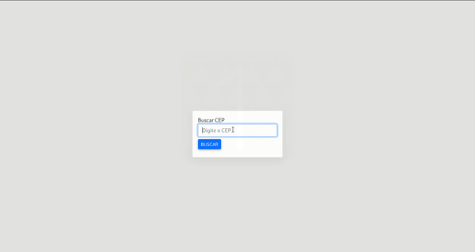

# LocalizarCep
Website de consulta de Cep, consumindo a api ViaCEP. A consulta no cep é feita pelo nodejs e o frontend utiliza jquery ajax para se comunicar com o node. O estilo foi feito usando bootstrap.

# Preview



# Como rodar

Instale o node e o npm e na pasta 'BackEnd' digite pelo terminal:

```
npm i
```

```
node app.js
```

Com o servidor do node aberto pelo terminal, abra o index.html localizado na pasta FrontEnd utilizando algum navegador. A versão utilizada do node no projeto foi a 16.5.0 .